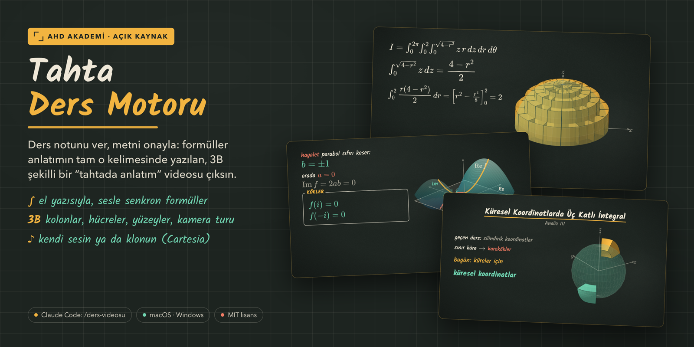
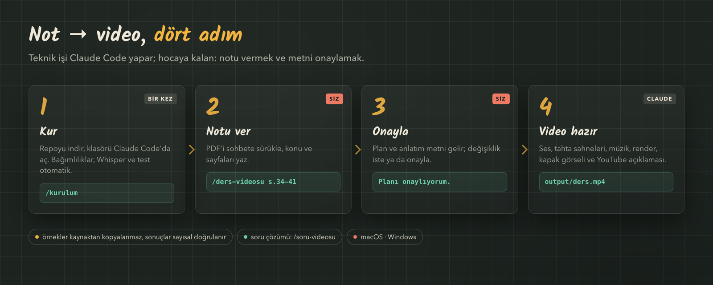
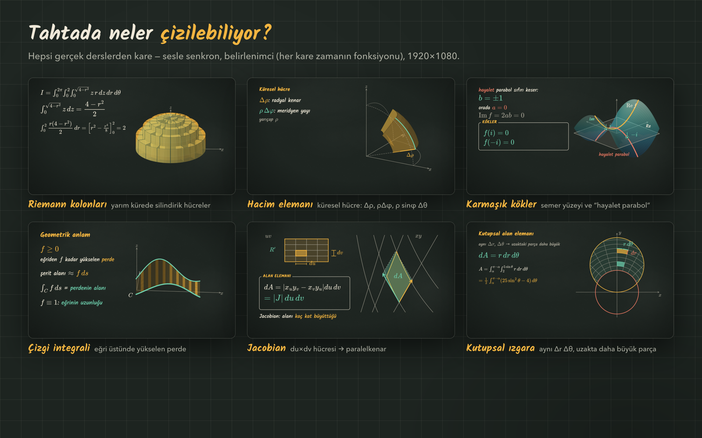
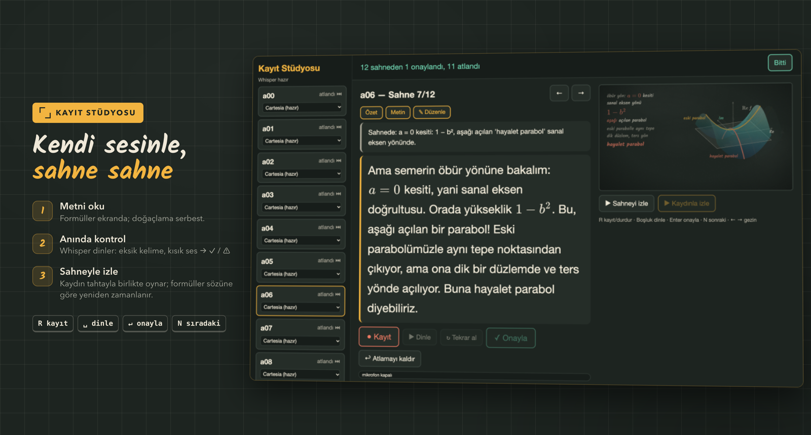

# Tahta Ders Motoru



AHD Akademi'nin "tahtada ders anlatımı" videolarını üreten açık kaynak sistem. Bir hoca tahtada yazıyormuş gibi:
formüller anlatımın tam o kelimesinde el yazısıyla çıkar, grafikler ve 3B şekiller anlatımla birlikte çizilir.
**Ders notunu ver, metni onayla — gerisini Claude Code yapsın.**

**→ Hocalar için adım adım başlangıç: [docs/BASLANGIC.md](docs/BASLANGIC.md)**







## Özellikler
- 1920×1080, 30 fps. Her kare yalnızca zamanın fonksiyonu (`window.__render(t)`): tarayıcı önizlemesi ile render birebir aynı.
- Matematik MathJax ile önceden SVG'ye çevrilir, el yazısı animasyonuyla yazılır.
- 3B: tek derinlik sıralamalı motor — Riemann kolonları, silindirik/küresel hücreler, yarı saydam cisimler, dilimler, kamera turu.
- Ses: **kendi sesinle kayıt stüdyosu** (yerel Whisper kontrolü) ve/veya TTS (Cartesia; kendi ses klonunla).
- Senkron: gerçek sesten kelime zamanları (Whisper) → her satır anlatımdaki "cue" kelimesinde başlar.
- macOS (Apple Silicon: mlx-whisper) ve Windows (faster-whisper).

Örnek ders olarak repo, "Ardışık İntegraller ve Fubini" dersinin sahnelerini ve metnini içerir (ses dosyaları hariç).

## Kurulum (macOS veya Windows)
En kolayı: Claude Code'da `/kurulum` (ayrıntı: docs/BASLANGIC.md). Elle kurulum (macOS örneği):
```bash
# 1) Node bağımlılıkları (mathjax-full, puppeteer-core, kalam fontu)
npm install
# 2) Whisper ortamı (kelime zamanları + stüdyo kontrolü). Masaüstü iCloud'daysa venv'i Masaüstü DIŞINDA kur!
python3.12 -m venv ~/.venvs/ders-whisper && ~/.venvs/ders-whisper/bin/pip install mlx-whisper numpy
ln -s ~/.venvs/ders-whisper .venv
# 3) ffmpeg ve Google Chrome gerekli
brew install ffmpeg
# 4) TTS kullanacaksan
cp .env.example .env   # içine kendi anahtarını yaz, .env asla git'e girmez
```

## Hızlı deneme
```bash
node tools/build_math.mjs                       # formül önbelleği
open index.html                                 # önizleme: Boşluk oynat, D debug (cue zamanları), C altyazı
node tools/warnings.mjs --lesson=lesson_full    # senkron kontrolü → WARNINGS (0) olmalı
```

## Claude Code ile video üretmek
Repo klasöründe `claude` aç ve yaz: `/ders-videosu Green teoremi, notlar.pdf s.169-176` (ya da `/soru-videosu …`).
Claude metni yazar ve onayını ister; onaydan sonra sesi (Cartesia, `.env`), sahneleri, miksi, render'ı ve thumbnail'i hazırlar.
Kendi sesinle okumak istersen metinde ilgili sahnelere `voice: 'own'` dedir; stüdyo açılır, sen kaydedersin.

## Belgeler
- **[CLAUDE.md](CLAUDE.md)** — baştan sona üretim hattı ve kurallar (Claude Code ile çalışmak için yazıldı; insan için de okunur).
- **[docs/ENGINE.md](docs/ENGINE.md)** — sahne öğeleri (text, math, theorem, graph2d, graph3d…), cue/zamanlama, SFX, render ayrıntıları.

Lisans: MIT (bkz. LICENSE). Kalam fontu SIL Open Font License altındadır.
